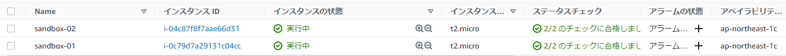
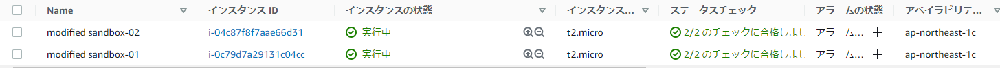
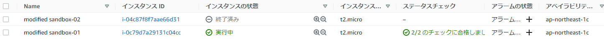
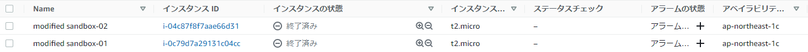

# 10分間TerraformでEC2起動

## Terraform とは
---
インフラストラクチャ定義ツール に分類されるツールで、クラウド上のリソースを定義ファイルの状態になるように生成・操作してくれます

インフラの構成を宣言的に定義できるところが特徴で、構築手順を書くのと違って構成定義のみに集中することができます
※宣言的に定義できる とは「t2.micro インスタンスを1つ」と書くだけで、作成手順を意識しなくてもその通りに出来上がるということです
単純にスクリプト化するだけだと、手続き的に構築手順を書く必要があります

## 定義ファイル
---
`.tf` ファイルに定義内容を記述し、`$ terraform apply `を実行するだけで定義内容の通りに自動でインフラを構築してくれます
## インストール (Windows 10の場合)
---
* 以下に従って OS 毎のビルド済みバイナリをダウンロードしてきてパスを通すだけ  
https://www.terraform.io/intro/getting-started/install.html
* 環境変数の `Path` に `terraform.exeを格納しているディレクトリ` を追加する  
例:`C:\Program Files (x86)\terraform`   
* コマンドプロンプトを起動してPATHが通っていることを確認する   
terraform version を叩いてバージョンが表示されたらOK

## AWS での使い方
### 事前準備
---
#### IAM ユーザーを作る
aws cli を利用するための アクセスキーを取得します
管理者に依頼して IAM ユーザーを作成してもらってください
https://console.aws.amazon.com/iam/home?#/home

* 利用したい AWS サービス(EC2、S3とか)に対しての操作権限をつけてもらう必要があります

#### AWS CLI をセットアップする
以下を参考に aws コマンドを使えるように設定する   
http://docs.aws.amazon.com/ja_jp/streams/latest/dev/kinesis-tutorial-cli-installation.html

`$ aws configure` で認証情報をセットした後であれば自動でこのAWS認証情報を参照してくれます
※~/.aws/credentials にAWSの認証情報が保存されます

### EC2インスタンスを作成する
---
**1. .tf ファイルを作成する**
* AWS の認証情報をセットする
variables.tf ファイルを作成し、操作したいリージョン を以下のように記述します
```
variables.tf
provider "aws" {
  region  = "ap-northeast-1"
}
terraform {
  required_providers {
    aws = {
      source = "hashicorp/aws"
      version = "3.71.0"
    }
  }
}
```
* EC2 のスペックを定義する
```
ec2.tf
resource "aws_instance" "sandbox" {
  count         = 2
  ami           = "ami-07d9583de36e83d10" # Ubuntu Server 18.04 LTS 
  instance_type = "t2.micro"

  tags = {
    Name = "${format("modified sandbox-%02d", count.index + 1)}"
  }
}
```

上記は以下を表してます

2つインスタンスを生成する  
AMI: ami-07d9583de36e83d10 (Ubuntu 18.04 LST)   
t2.micro   
Name に "sandbox-xx"    

**2. 定義内容をチェックする**   
variable.tf と ec2.tf が置かれているディレクトリ内で以下を実行

初めて実行する場合のみ初期化のために init を実行します
```
init
$ terraform init
```

出力結果
```
Initializing the backend...

Initializing provider plugins...
- Reusing previous version of hashicorp/aws from the dependency lock file
- Using previously-installed hashicorp/aws v3.71.0

Terraform has been successfully initialized!
```
定義内容のチェックは plan を実行します
```
plan
$ terraform plan
```    

定義内容が意図した通りに反映されるかを確認します
```
出力結果
〜
+ aws_instance.sandbox[0] 
    + ami                                  = "ami-07d9583de36e83d10"
〜
      + tags                                 = {
          + "Name" = "sandbox-01"
        }

〜
+ aws_instance.sandbox[1] 
    + ami                                  = "ami-07d9583de36e83d10"
〜
      + tags                                 = {
          + "Name" = "sandbox-02"
        }
〜
Plan: 2 to add, 0 to change, 0 to destroy.
```
**3. 定義を適用してインスタンスを作成する**  
* 同ディレクトリ内で以下を実行
```
apply
$ terraform apply
2 . 出力を確認
ずらーーーーーっと出るので、2オブジェクトが add されたことを確認
```
```
出力結果
〜
Apply complete! Resources: 2 added, 0 changed, 0 destroyed.
〜
```
* terraform show を見てみる  
terraform が作成したオブジェクトの内容が出力されます
```
出力結果
$ terraform show
aws_instance.sandbox.0:
  id = i-02bbfece7cbf56027
〜
aws_instance.sandbox.1:
  id = i-0aad82a9b81951965
〜
```
* EC2 コンソールを確認
sandbox-01 sandbox-02 の 2つのインスタンスが作成されていることが確認できます



**4. 定義内容を変更する**  
今あるインスタンスの設定値を変更する
* インスタンスの名称を modified sandbox-xx に変更する
```
ec2.tf
〜
     Name = "${format("modified sandbox-%02d", count.index + 1)}"
〜
```
* 変更内容をチェック
```
plan
$ terraform plan
〜
  # aws_instance.sandbox[0] will be updated in-place
  ~ resource "aws_instance" "sandbox" {
        id                                   = "i-0c79d7a29131c04cc"
      ~ tags                                 = {
          ~ "Name" = "sandbox-01" -> "modified sandbox-01"
        }
      ~ tags_all                             = {
          ~ "Name" = "sandbox-01" -> "modified sandbox-01"
        }

〜
```
tag の差分が表示されていることがわかります

* 変更を適用
```
apply
$ terraform apply
〜
Apply complete! Resources: 0 added, 2 changed, 0 destroyed.
〜
```
* terraform show で確認
```
show
$ terraform show
aws_instance.sandbox[0]:
〜
      tags                                 = {
        "Name" = "modified sandbox-01"
    }

〜
aws_instance.sandbox[1]:
〜
      tags                                 = {
        "Name" = "modified sandbox-02"
    }
〜
```
tag の変更が反映されてます

* ec2 コンソールを確認
コンソールからも変更が確認できます  


インスタンスの数を変更する  
1 . count を 1 に変更する
```
ec2.tf
〜
  count         = 1
〜
```
2 . 変更内容をチェック
```
plan
$ terraform plan
〜
- aws_instance.sandbox.1

Plan: 0 to add, 0 to change, 1 to destroy.
```
sandbox.1 が削除されるということがわかります

3 . 変更を適用
```
apply
$ terraform apply
〜
Apply complete! Resources: 0 added, 0 changed, 1 destroyed.
```
sandbox.1 が削除されたログが出力されています

4 . ec2 コンソールを確認
modified sandbox-02 が削除されたことがわかります


**5. terraform で定義したリソースを全て削除する**  
1 . terraform destroy
確認を促すプロンプトが出るので "yes" を入力すると削除が開始されます
```
destroy
$ terraform destroy
Plan: 0 to add, 0 to change, 1 to destroy.

Do you really want to destroy all resources?
  Terraform will destroy all your managed infrastructure, as shown above.
  There is no undo. Only 'yes' will be accepted to confirm.

  Enter a value: yes


aws_instance.sandbox[0]: Destroying... [id=i-0c79d7a29131c04cc]
aws_instance.sandbox[0]: Still destroying... [id=i-0c79d7a29131c04cc, 10s elapsed]
aws_instance.sandbox[0]: Still destroying... [id=i-0c79d7a29131c04cc, 20s elapsed]
aws_instance.sandbox[0]: Still destroying... [id=i-0c79d7a29131c04cc, 30s elapsed]
aws_instance.sandbox[0]: Still destroying... [id=i-0c79d7a29131c04cc, 40s elapsed]
aws_instance.sandbox[0]: Destruction complete after 41s

Destroy complete! Resources: 1 destroyed.

```
2 . terraform show で確認
```
show
$ terraform show
```

管理下のオブジェクトが何もないことが確認できます

3 . ec2 コンソールで確認


全て削除されていることがわかります